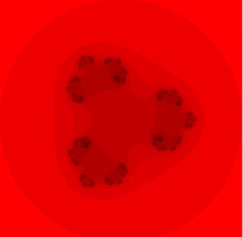
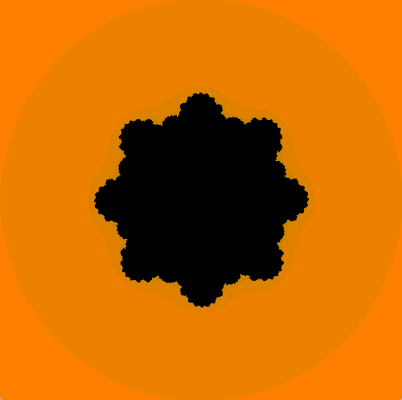
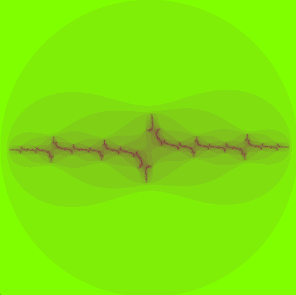
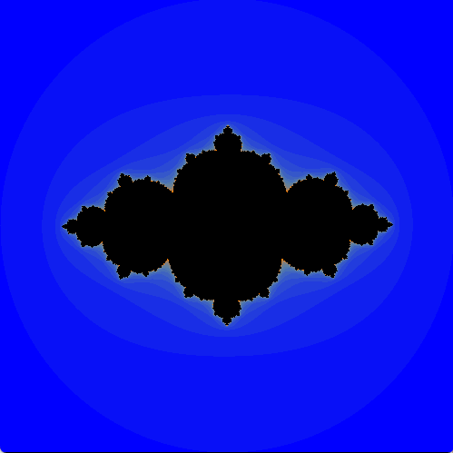

## Fractals 

Implemented the Julia set fractals. you ccould change the constant and the power for more diverse shape generation.

 
$$ z_{n+1}= z_{n}^p + c$$

- $p$ is the power number defining the set.
- $c$ is a random fixed complex number ($c$ should be differetn than $2$ ans $0$).

---

To run the program:

```
./config.sh
./build.sh
./run.sh
```
>
---
### Outputs
 <p align="center">
  
 </p>
  <p align="center">
  
 </p>
---
### Resources:

* [Julia set (wiki)](https://en.wikipedia.org/wiki/Julia_set)
* [glfw](https://www.glfw.org/) 